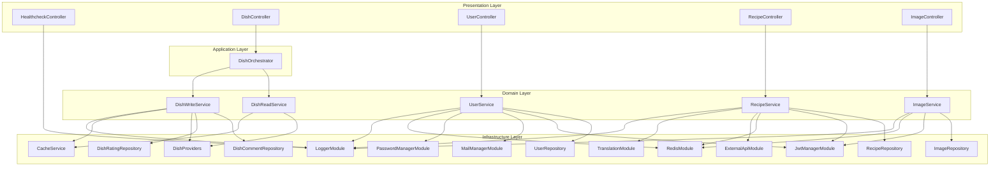
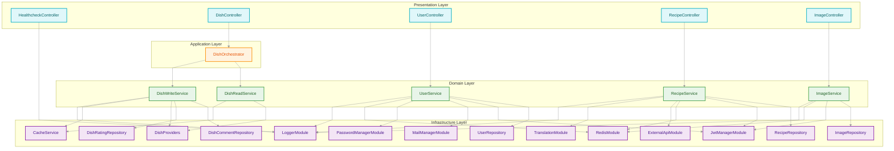

# Layer Architecture

This is four-layer architecture.

The graph:

```mermaid
graph TD

%% === Presentation Layer ===
subgraph Presentation Layer
  HealthcheckController
  DishController
  UserController
  RecipeController
  ImageController
end

%% === Application Layer ===
subgraph Application Layer
  DishOrchestrator
end

%% === Domain Layer ===
subgraph Domain Layer
  DishReadService
  DishWriteService
  UserService
  RecipeService
  ImageService
end

%% === Infrastructure Layer ===
subgraph Infrastructure Layer
  DishCommentRepository
  DishRatingRepository
  UserRepository
  RecipeRepository
  ImageRepository
  CacheService
  DishProviders
  JwtManagerModule
  RedisModule
  ExternalApiModule
  TranslationModule
  MailManagerModule
  PasswordManagerModule
  LoggerModule
end

%% === Connections ===

%% Presentation → Application / Domain
DishController --> DishOrchestrator
UserController --> UserService
RecipeController --> RecipeService
ImageController --> ImageService
HealthcheckController --> LoggerModule

%% Application → Domain
DishOrchestrator --> DishReadService
DishOrchestrator --> DishWriteService

%% Domain → Infrastructure
DishReadService --> DishProviders
DishReadService --> CacheService
DishWriteService --> DishCommentRepository
DishWriteService --> DishRatingRepository
DishWriteService --> DishProviders
DishWriteService --> CacheService
DishWriteService --> LoggerModule

UserService --> UserRepository
UserService --> JwtManagerModule
UserService --> MailManagerModule
UserService --> PasswordManagerModule
UserService --> RedisModule

RecipeService --> RecipeRepository
RecipeService --> JwtManagerModule
RecipeService --> RedisModule
RecipeService --> ExternalApiModule
RecipeService --> TranslationModule

ImageService --> ImageRepository
ImageService --> JwtManagerModule
ImageService --> RedisModule

%% Logger used everywhere (optional)
UserService --> LoggerModule
RecipeService --> LoggerModule
ImageService --> LoggerModule
```

And coloured one:

```mermaid
%%{ init: { 'theme': 'default', 'themeVariables': { 'lineColor': '#999' }, 'flowchart': { 'curve': 'linear' } } }%%


graph TD

%% === Presentation Layer ===
subgraph Presentation Layer
  classDef presentation fill:#e0f7fa,stroke:#00acc1,color:#006064,stroke-width:2;
  HealthcheckController:::presentation
  DishController:::presentation
  UserController:::presentation
  RecipeController:::presentation
  ImageController:::presentation
end

%% === Application Layer ===
subgraph Application Layer
  classDef application fill:#fff3e0,stroke:#fb8c00,color:#e65100,stroke-width:2;
  DishOrchestrator:::application
end

%% === Domain Layer ===
subgraph Domain Layer
  classDef domain fill:#e8f5e9,stroke:#43a047,color:#1b5e20,stroke-width:2;
  DishReadService:::domain
  DishWriteService:::domain
  UserService:::domain
  RecipeService:::domain
  ImageService:::domain
end

%% === Infrastructure Layer ===
subgraph Infrastructure Layer
  classDef infra fill:#f3e5f5,stroke:#8e24aa,color:#4a148c,stroke-width:2;
  DishCommentRepository:::infra
  DishRatingRepository:::infra
  UserRepository:::infra
  RecipeRepository:::infra
  ImageRepository:::infra
  CacheService:::infra
  DishProviders:::infra
  JwtManagerModule:::infra
  RedisModule:::infra
  ExternalApiModule:::infra
  TranslationModule:::infra
  MailManagerModule:::infra
  PasswordManagerModule:::infra
  LoggerModule:::infra
end

%% === Connections ===

%% Presentation → Application / Domain
DishController --> DishOrchestrator
UserController --> UserService
RecipeController --> RecipeService
ImageController --> ImageService
HealthcheckController --> LoggerModule

%% Application → Domain
DishOrchestrator --> DishReadService
DishOrchestrator --> DishWriteService

%% Domain → Infrastructure
DishReadService --> DishProviders
DishReadService --> CacheService
DishWriteService --> DishCommentRepository
DishWriteService --> DishRatingRepository
DishWriteService --> DishProviders
DishWriteService --> CacheService
DishWriteService --> LoggerModule

UserService --> UserRepository
UserService --> JwtManagerModule
UserService --> MailManagerModule
UserService --> PasswordManagerModule
UserService --> RedisModule

RecipeService --> RecipeRepository
RecipeService --> JwtManagerModule
RecipeService --> RedisModule
RecipeService --> ExternalApiModule
RecipeService --> TranslationModule

ImageService --> ImageRepository
ImageService --> JwtManagerModule
ImageService --> RedisModule

%% Logger used generally
UserService --> LoggerModule
RecipeService --> LoggerModule
ImageService --> LoggerModule
```