# Layer Architecture

This is four-layer architecture.

The graph:

```mermaid
graph TD

%% === Presentation Layer ===
    subgraph Presentation Layer
        HealthcheckController
        DishController
        UserController
        RecipeController
        ImageController
    end

%% === Application Layer ===
    subgraph Application Layer
        DishOrchestrator
    end

%% === Domain Layer ===
    subgraph Domain Layer
        DishReadService
        DishWriteService
        DishAggregatorService
        UserService
        RecipeService
        ImageService
    end

%% === Infrastructure Layer ===
    subgraph Infrastructure Layer
        DishCommentRepository
        DishRatingRepository
        UserSearchQueryRepository
        UserRepository
        RecipeRepository
        ImageRepository
        CacheService
        DishCacheService
        DishProviders
        DishSourceRegistryService
        JwtManagerService
        RedisService
        ExternalApiService
        TranslationService
        MailManagerService
        PasswordManagerService
        LoggerService
        NotificationService
    end

%% === Connections ===

%% Presentation → Application / Domain
    DishController --> DishOrchestrator
    UserController --> UserService
    RecipeController --> RecipeService
    ImageController --> ImageService

%% Application → Domain
    DishOrchestrator --> DishReadService
    DishOrchestrator --> DishWriteService

%% Application → Infrastructure
    DishOrchestrator --> UserSearchQueryRepository

%% Domain → Infrastructure
    DishReadService --> DishCacheService
    DishReadService --> DishAggregatorService
    DishReadService --> DishSourceRegistryService
    DishAggregatorService --> DishSourceRegistryService

    DishWriteService --> DishCommentRepository
    DishWriteService --> DishRatingRepository
    DishWriteService --> DishSourceRegistryService
    DishWriteService --> DishCacheService

    DishSourceRegistryService --> DishProviders

    UserService --> UserRepository
    UserService --> JwtManagerService
    UserService --> MailManagerService
    UserService --> PasswordManagerService
    UserService --> RedisService

    RecipeService --> RecipeRepository
    RecipeService --> JwtManagerService
    RecipeService --> RedisService
    RecipeService --> ExternalApiService
    RecipeService --> TranslationService

    ImageService --> ImageRepository
    ImageService --> JwtManagerService
    ImageService --> RedisService
```

And coloured one:

```mermaid
%%{ init: { 'theme': 'default', 'themeVariables': { 'lineColor': '#888' }, 'flowchart': { 'curve': 'linear' } } }%%

graph TD

%% === Presentation Layer ===
    subgraph Presentation Layer
        classDef presentation fill:#e0f7fa,stroke:#00acc1,color:#006064,stroke-width:2;
        HealthcheckController:::presentation
        DishController:::presentation
        UserController:::presentation
        RecipeController:::presentation
        ImageController:::presentation
    end

%% === Application Layer ===
    subgraph Application Layer
        classDef application fill:#fff3e0,stroke:#fb8c00,color:#e65100,stroke-width:2;
        DishOrchestrator:::application
    end

%% === Domain Layer ===
    subgraph Domain Layer
        classDef domain fill:#e8f5e9,stroke:#43a047,color:#1b5e20,stroke-width:2;
        DishReadService:::domain
        DishWriteService:::domain
        DishAggregatorService:::domain
        UserService:::domain
        RecipeService:::domain
        ImageService:::domain
    end

%% === Infrastructure Layer ===
    subgraph Infrastructure Layer
        classDef infra fill:#f3e5f5,stroke:#8e24aa,color:#4a148c,stroke-width:2;
        DishCommentRepository:::infra
        DishRatingRepository:::infra
        UserSearchQueryRepository:::infra
        UserRepository:::infra
        RecipeRepository:::infra
        ImageRepository:::infra
        CacheService:::infra
        DishCacheService:::infra
        DishProviders:::infra
        DishSourceRegistryService:::infra
        JwtManagerService:::infra
        RedisService:::infra
        ExternalApiService:::infra
        TranslationService:::infra
        MailManagerService:::infra
        PasswordManagerService:::infra
        LoggerService:::infra
        NotificationService:::infra
    end

%% === Connections ===

%% Presentation → Application / Domain
    DishController --> DishOrchestrator
    UserController --> UserService
    RecipeController --> RecipeService
    ImageController --> ImageService
%%    HealthcheckController --> LoggerService

%% Application → Domain
    DishOrchestrator --> DishReadService
    DishOrchestrator --> DishWriteService

%% Application → Infrastructure
%%    DishOrchestrator --> DishCommentRepository
%%    DishOrchestrator --> DishRatingRepository
    DishOrchestrator --> UserSearchQueryRepository

%% Domain → Infrastructure
%%    DishReadService --> DishProviders
    DishReadService --> DishCacheService
    DishReadService --> DishAggregatorService
    DishReadService --> DishSourceRegistryService
    DishAggregatorService --> DishSourceRegistryService

    DishWriteService --> DishCommentRepository
    DishWriteService --> DishRatingRepository
    DishWriteService --> DishSourceRegistryService
    DishWriteService --> DishCacheService
%%    DishWriteService --> LoggerService

    UserService --> UserRepository
    UserService --> JwtManagerService
    UserService --> MailManagerService
    UserService --> PasswordManagerService
    UserService --> RedisService
%%    UserService --> LoggerService

    RecipeService --> RecipeRepository
    RecipeService --> JwtManagerService
    RecipeService --> RedisService
    RecipeService --> ExternalApiService
    RecipeService --> TranslationService
%%    RecipeService --> LoggerService

    ImageService --> ImageRepository
    ImageService --> JwtManagerService
    ImageService --> RedisService
%%    ImageService --> LoggerService

%% Infrastructure internal connection
%%    NotificationService --> LoggerService
```

Those graphs represent four-layer architecture. However, it can be simplified by introducing some elements in presentation layer that checks user token and provide some information about them.

Logger and Notification does not have any dependencies not to black out the graph. It's worth to note that logger could be attached only to Domain Layer.