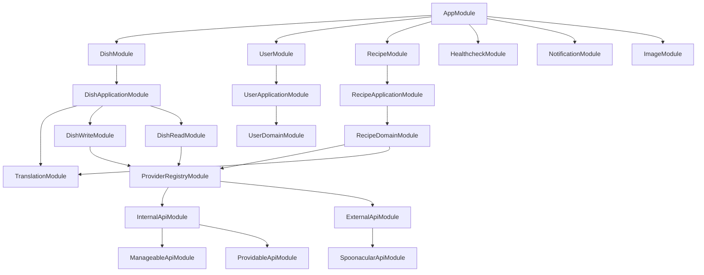

The below graph presents current modular hierarchy:

The following modules are global and are not presented in the above graph:
- `LoggerModule`
- `JwtManagerModule`
- `CacheModule`
- `IngredientModule`
- `HttpModule`