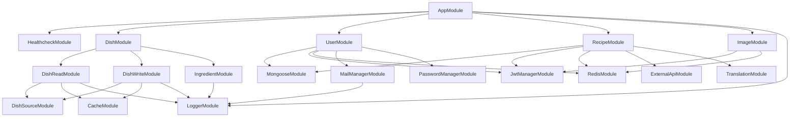

Hitherto, the graph is quite complex:

It is caused by two modules: `LoggerModule` and `JwtManagerModule`. Some references of `LoggerModule` are unnecessary. This module should be included in the last but one layer only.

When it comes to `JwtManagerModule` could be simplified. The use of guards and providing some user information could be enough.